# SOME INSTRUCTION

## 1.如果你需要将一个代码仓库克隆下来：

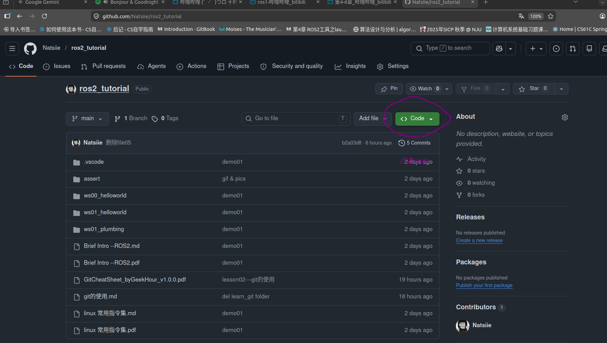

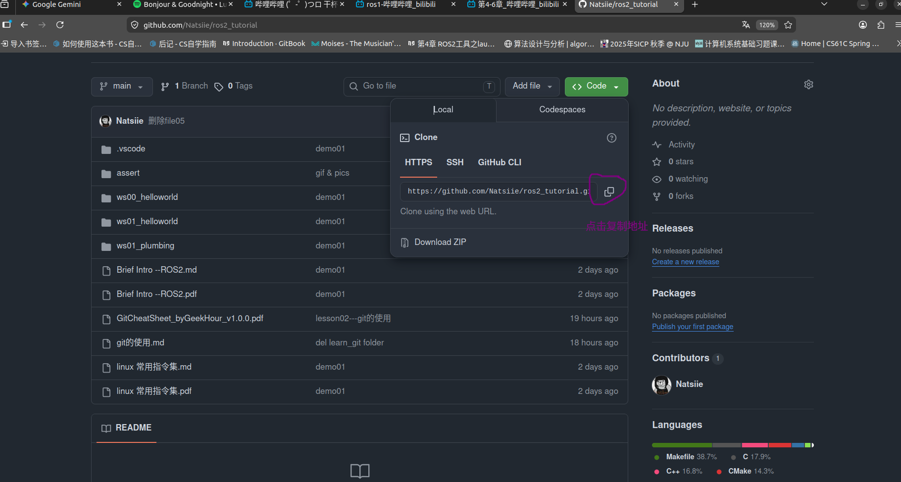

## 终端输入：git clone  仓库地址

## 即可把仓库地址下对应的文件夹拉到自己电脑上

## 2.基本介绍

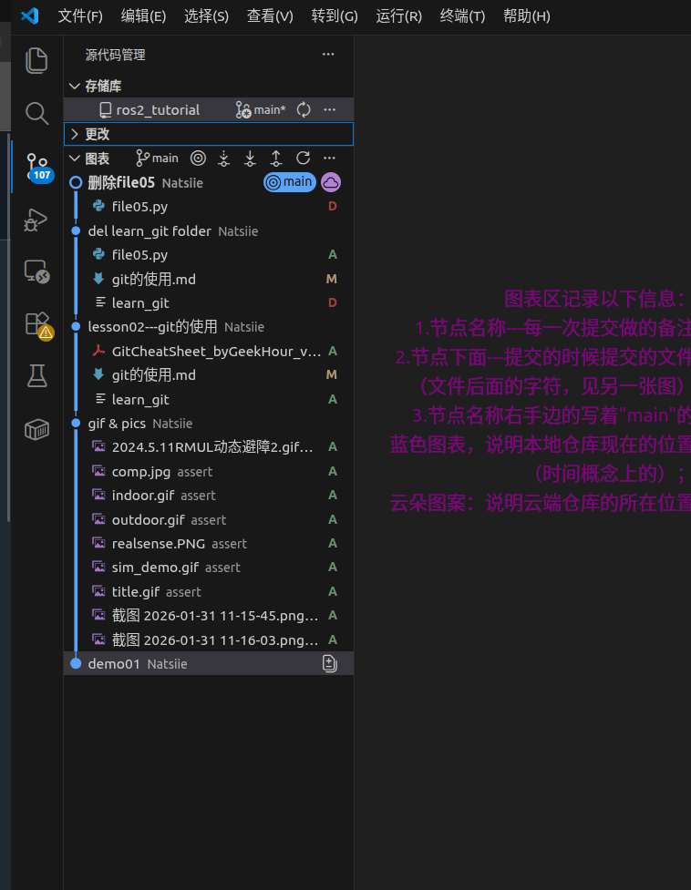

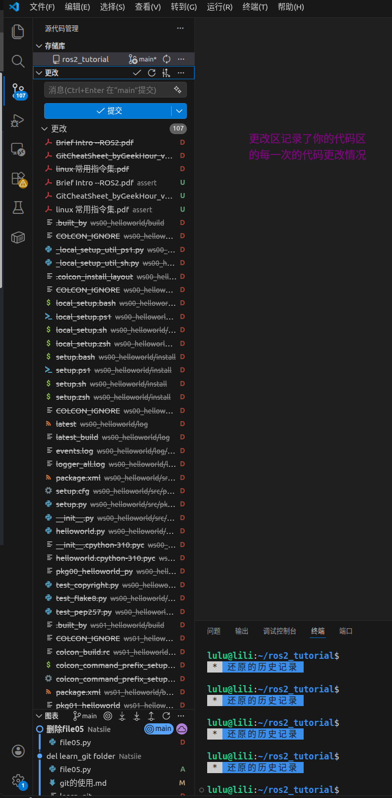

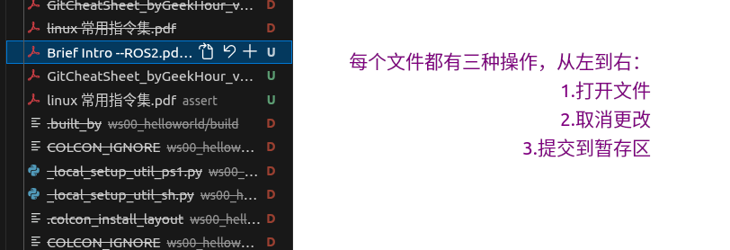

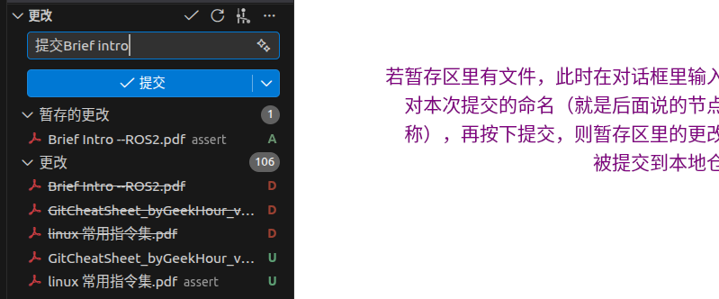

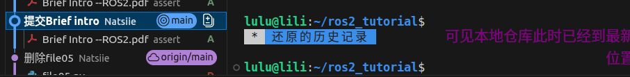

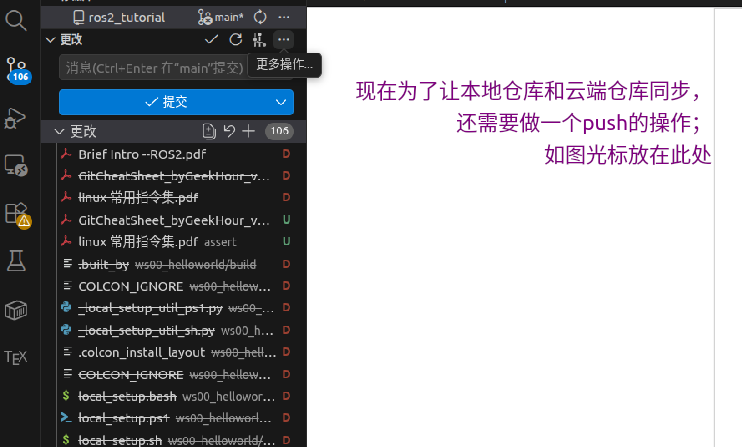

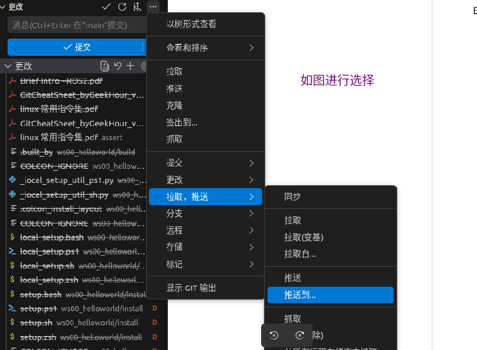

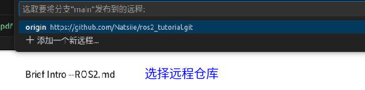

（选择好就ok了）

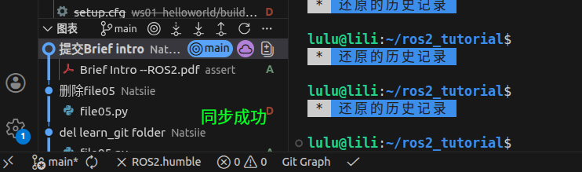

（此时在你的github仓库就能看到你的最新更改了）

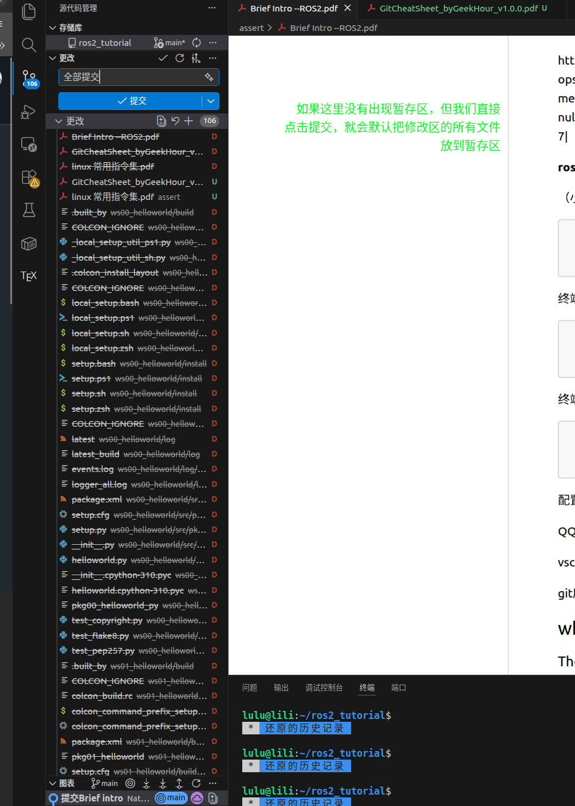

（错了，文本应该是“......   默认把所有修改文件放到本地仓库”）

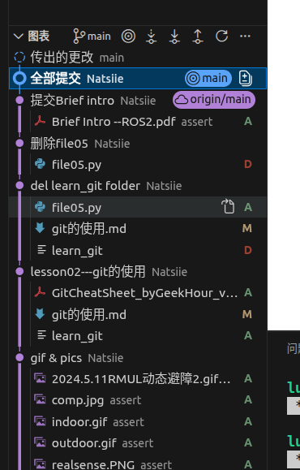

PS：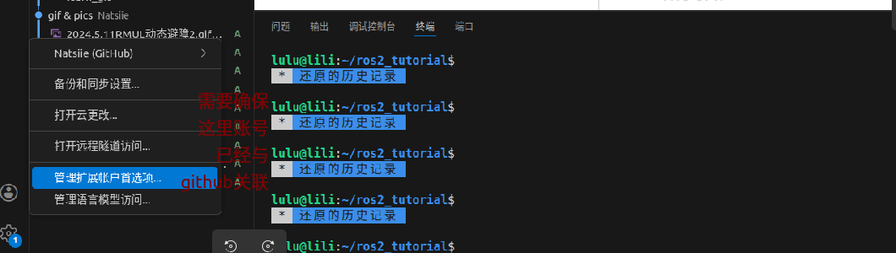

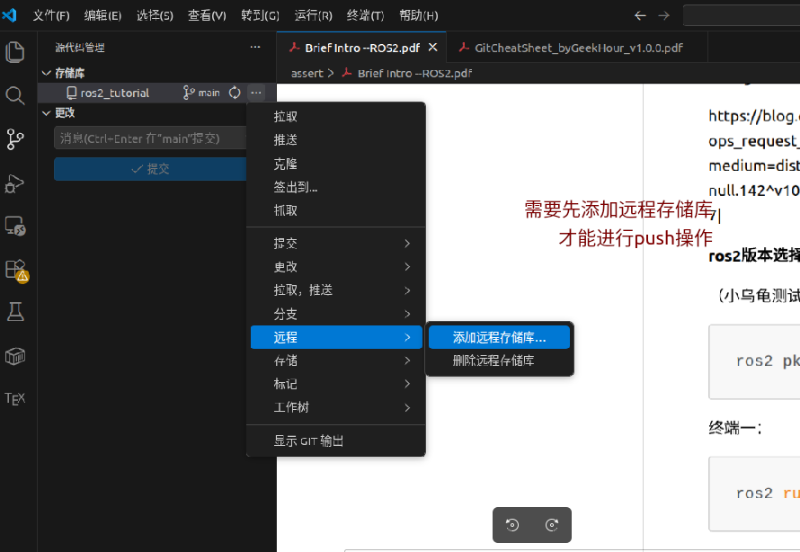

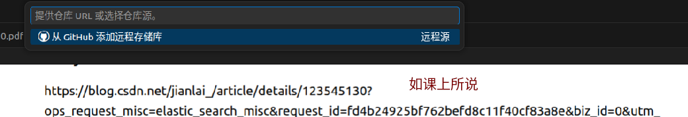

（或者像1.所说，复制仓库地址进来）

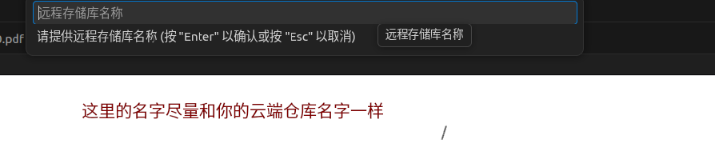

## 3.修改完文件，请记得保存：

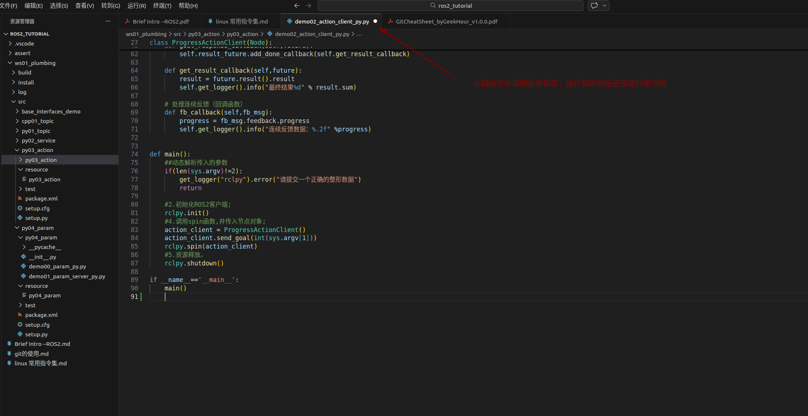

## 4.vscode里，按住ctrl 和 +，放大;ctrl 和 - 缩小
