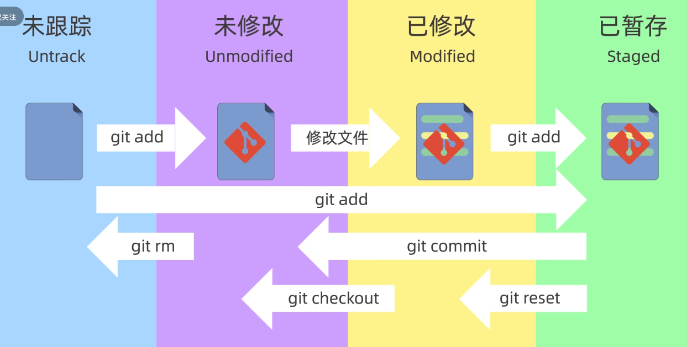
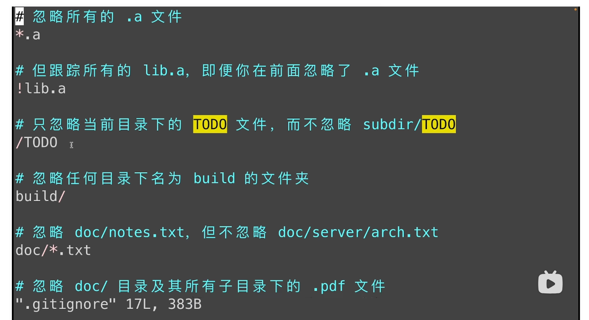
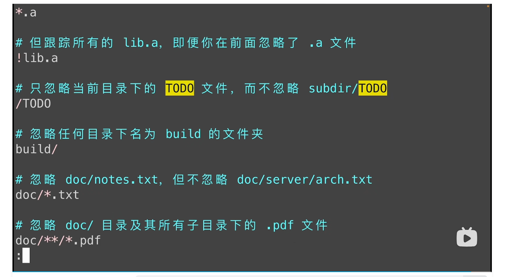
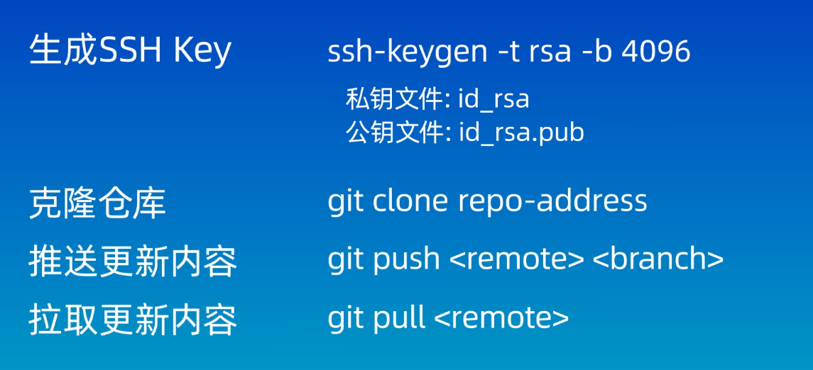
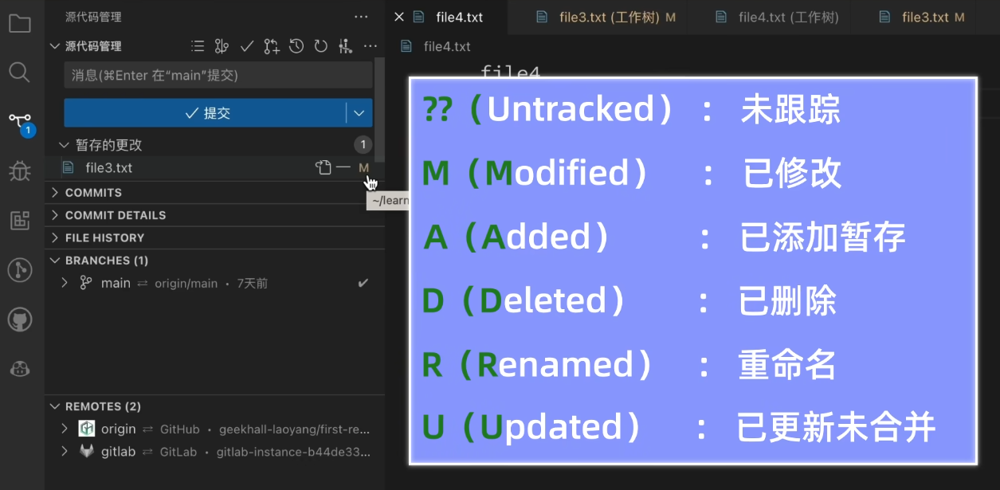

# git ?  steam !

## with terminator

### git仓库的初始化：

1. git config --global user.name "用户名" //双引号要保留

2. git config --global user.email 邮箱地址（github注册时用的邮箱）

3. git config --global --list  //查看git的配置信息

4. git config --global credential.helper store   //把git的登陆信息存在电脑里，以后默认使用这个配置

### 创建仓库

1. git init

2. git clone

（# 设置全局默认分支名为 main

git config --global init.defaultBranch main

以后新建仓库时就会自动用 main 了）

（工作区域的分类）

（文件的类型）

git status // 查看仓库的状态

git add  //将文件添加到暂存区

git add **.txt* // 将当前路径下，所有.txt为后缀的文件都添加到缓存区

git add  .     //将当前路径下的所有文件都添加到暂存区

git rm --cached <文件>...  以取消暂存  

git commit  //提交暂存区中的文件到本地仓库

git commit -m "参数" //用参数里的信息给提交记录做备注

git log   //查看git的提交记录

git reset  //回退版本

git reset --soft  版本id

git  reset --hard  版本id

git reset --mixed  版本id  //默认使用

git reset --argc HEAD^ // 回退到上一个提交版本

git reset --argc HEAD~n //回退到前n个版本

git reflog  //查看操作的历史记录

git ls-files  //查看暂存区的内容

git diff  //查看工作区，暂存区，本地版本之间的差异

git diff //默认比较工作区和暂存区之间的差异内容

git  diff HEAD   // 比较工作区和本地仓库的差异

git diff  --cached  //比较暂存区和本地仓库的差异

git diff HEAD~ HEAD  //上个版本和当前版本的比较

git rm 文件名  //删除工作区域和暂存区中的文件

git rm --cached 文件名  //仅删除的是暂存区里的文件

（ps: 执行之后记得commit,不然本地仓库中依然存在）

.gitignore  

（ps:已经添加到仓库里的文件，修改后前后都不会被放到.gitignore里）

access.log
*.log
temp/     #忽略这个temp文件夹下的内容

## 连接远程仓库：

## with your vscode

### 

